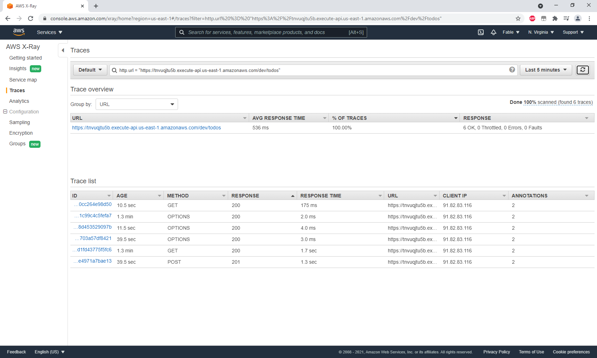

# Serverless TODO

Implementing a simple TODO application using AWS Lambda and Serverless framework.

The frontend is configured to be run locally (npm install && npm run start)

## Development

Using the free service of auth0.com, I've registered a new application for my domain, named TODOApp. In the advanced settings/JWT type I've selected the RS256 and downloaded my certificate. I've set the callback URL to http://localhost:3000/callback to receive the authentication data (user (sub) id, token), and the Allowed Web Origins to http://localhost:3000 to allow connection. The domain and client id values saved in client/config.ts.

For token verification in backend/src/lambda/auth/auth0Authorizer.ts, I've set the certificate URL and followed the guide in https://auth0.com/blog/navigating-rs256-and-jwks/ and in https://github.com/auth0/node-jwks-rsa/blob/master/examples/express-demo/README.md. However the JSON file also has my other certificates, for the Udagram app, so later I changed back to include it in the source code.

Next I filled all the functions with mock data, and filled out the serverless.yml file with resource definitions for S3 and DynamoDB table structure.

After successful deployment, I copied the API Gateway ID to client/src/config.ts

The frontend `npm install` failed on a file rename, I suspect Visual Code in the background was parsing the files during setup. Closed VC, deleted package-lock.json and node_modules, and re-run the install successfully.

After frontend login, I got CORS errors, which was caused by missing `cors: true` for all the API calls.

The frontend now shows the mock data. Interestingly, the delete button works already, due to smart code on the client side.

Since I log all functions, I could already check in CloudWatch that all functions receive correct parameters. Authorization is not tested at this moment yet, because it's not yet configured. The UserId can be read from the authorization header, so next I implemented the functions using DynamoDB table.

First function has to be of course the createTodoItem. I've moved the DynamoDB specific functions to a new file, aws_access/createTodoItem.ts. When testing the new functionality, I got CORS error, but inspecting the headers revealed `InternalServerErrorException` in the header, so the CORS header was only missing because of an earlier exception.

From CloudWatch: `"errorMessage": "User: arn:aws:sts::447830847150:assumed-role/serverless-todo-app-dev-us-east-1-lambdaRole/serverless-todo-app-dev-CreateTodo is not authorized to perform: dynamodb:PutItem on resource: arn:aws:dynamodb:us-east-1:447830847150:table/Todos-dev"`

Since using `serverless-iam-roles-per-function` I added the following to the `CreateTodos` function:

```yaml
iamRoleStatements:
    - Effect: Allow
      Action:
        - dynamodb:PutItem
      Resource: arn:aws:dynamodb:${self:provider.region}:*:table/${self:provider.environment.TODOS_TABLE}
```

The deploy function failed with an error, Knowledge base suggested updating the package:

`npm i serverless-iam-roles-per-function@next`

The package.json was updated to: `"serverless-iam-roles-per-function": "^3.2.0-e97ab49",`

The client was working already, showing the new item, but of course, the new item vanished after refresh, so the next step was to implement GetTodos.

The implementation was straight forward, but the client got empty response. CloudWatch revealed `ERROR	(node:8) [DEP0005] DeprecationWarning: Buffer() is deprecated due to security and usability issues. Please use the Buffer.alloc(), Buffer.allocUnsafe(), or Buffer.from() methods instead.`

The issue was with missing `await`here:

```typescript
const db_result = {
    items: await getTodoItems(userId)
  }
```

Next error: `    "errorMessage": "User: arn:aws:sts::447830847150:assumed-role/serverless-todo-app-dev-GetTodos-us-east-1-lambdaRole/serverless-todo-app-dev-GetTodos is not authorized to perform: dynamodb:Query on resource: arn:aws:dynamodb:us-east-1:447830847150:table/Todos-dev/index/UserIdIndex",`

For the solution I used the example in Course 5, and added IamPolicy for the `Resource: arn:aws:dynamodb:${self:provider.region}:*:table/${self:provider.environment.TODOS_TABLE}/index/${self:provider.environment.USER_ID_INDEX}`

The item created previously was now listed in the browser.

Next was the delete item. The first error in CloudWatch was ` "errorMessage": "The provided key element does not match the schema"`

The problem here was described here: https://stackoverflow.com/questions/34259358/dynamodb-delete-all-items-having-same-hash-key

The solution was to include the RANGE key as well to make the record unique, which would have been dueDate in this case, since I originally added dueDate as RANGE key. When I deleted the RANGE key, deployment failed, so I deleted the table manually, and renamed the table as the CloudFront error suggested. After successful deployment, I renamed the table back to the original.

After implementing UpdateTodo, it didn't update the database, and I couldn't find any error message in CloudWatch. Searching the Knowledge Base I found that "name" attribute was replaced with ExpressionAttributeName, so I implemented it as well, but it didn't help. Logging the result revealed that I simply forgot to add ".promise()" to the end of the update call. After fixing, I could see the "done" flag updating in DynamoDB on AWS Console.

The last function was `GenerateUploadUrl`, I used the signed URL creation routine from the course 5, and the update from UpdateTodo in one function in `aws_access/GenerateUploadURL.ts`. I've set both dynamodb:UpdateItem and s3:PutObject in the iamRoleStatements of the lamda function. This one worked on first try.

Next step was to enable authorization for all functions. The first try reported `error:0909006C:PEM routines:get_name:no start line` in CloudWatch. I've fixed the new-lines in the certificate and it was working afterwards.

Next, I've set up request validator. I first tried with the plugin. For CreateTodoRequest and UpdateTodoRequest, I've created json files in model, set up a new resource, and linked the json files to the model names in the custom section. In the Knowledge Base it was suggested to have a minimum 3 characters for the name, so I included that too. I tried to create a 2-character long TODO item, and it was successful, so something didn't work. I realized I got warnings in the deployment:

```
Serverless: Configuration warning:
Serverless:   at 'functions.CreateTodo.events[0].http': unrecognized property 'reqValidatorName'
Serverless:   at 'functions.CreateTodo.events[0].http': unrecognized property 'documentation'
Serverless:   at 'functions.UpdateTodo.events[0].http': unrecognized property 'reqValidatorName'
Serverless:   at 'functions.UpdateTodo.events[0].http': unrecognized property 'documentation'
```

After searching for solution, I found that the plugin is no longer needed for serverless, and it's much simpler now:

```yaml
CreateTodo:
    handler: src/lambda/http/createTodo.handler
    events:
      - http:
          method: post
          path: todos
          cors: true
          authorizer: Auth
          request:
            schema:
              application/json: ${file(models/create-todo-request.json)}
```

After deployment, 2-character long name was denied, 3 character was accepted.

Finally, I've replaced console.log with Winston logger, which was already used in the auth lambda.

#### Reviewer suggestions

Changes I made to reviewers suggestion:

- According to https://aws.amazon.com/blogs/database/choosing-the-right-dynamodb-partition-key/ I was following the anti-pattern of partition key. I've changed the HASH to userId to have all the data for a specific user in the same partition. The sort key was then the todoId, together creating a complex key.
- Created business_logic/todoItem.ts file to connect lambda functions to AWS specific functions in the aws_access folder instead of calling them directly.
- Using aws-xray-sdk for tracing.

I got an error message for the following code:

`TS2339: Property 'DocumentClient' does not exist on type 'PatchedAWSClientConstructor<ClientConfiguration, typeof DynamoDB>'`

```typescript
import * as AWSXRay  from 'aws-xray-sdk'
const XAWS = AWSXRay.captureAWS(AWS)
const docClient = new XAWS.DynamoDB.DocumentClient()
```

There seem to be a typescript error with the sdk, changed "import" to "require":

```typescript
const AWSXRay = require('aws-xray-sdk')
```

## Project Rubric

#### Functionality

```
The application allows users to create, update, delete TODO items
A user of the web application can use the interface to create, delete and complete a TODO item.
```

I've tested the functionality through the frontend during development, and also in the DynamoDB AWS Console, as described in the development process. The frontend can be started locally with `npm run start`

```
The application allows users to upload a file.
A user of the web interface can click on a "pencil" button, then select and upload a file. A file should appear in the list of TODO items on the home page.
```

Here's a screenshot after uploading an attachment


```
The application only displays TODO items for a logged in user.
If you log out from a current user and log in as a different user, the application should not show TODO items created by the first account.
```


```
Authentication is implemented and does not allow unauthenticated access.
A user needs to authenticate in order to use an application.
```

Authentication is implemented in backend/src/lamda/auth/auth0authorization.ts:

```typescript
if (jwt.header.alg !== 'RS256') {
      // we are only supporting RS256 so fail if this happens.
      throw new Error('Invalid authentication algorithm');
  }

  return verify(token, cert, { algorithms: ['RS256'] }) as JwtPayload
```


#### Code Base

```
The code is split into multiple layers separating business logic from I/O related code.
Code of Lambda functions is split into multiple files/classes. The business logic of an application is separated from code for database access, file storage, and code related to AWS Lambda.
```

The aws_access folder contains the database access and file storage routines.

The business_logic/todoItems.ts file simply forwards the calls to AWS specific functions.

```
Code is implemented using async/await and Promises without using callbacks.
To get results of asynchronous operations, a student is using async/await constructs instead of passing callbacks.
```

An example from getTodoItems:

```typescript
const result = await docClient.query({
        TableName: todosTable,
        IndexName: userIdIndex,
        KeyConditionExpression: 'userId = :userId',
        ExpressionAttributeValues: {
          ':userId': userId
        }
      }).promise()
    
    return result.Items as TodoItem[]
```

#### Best Practices

```
All resources in the application are defined in the "serverless.yml" file
All resources needed by an application are defined in the "serverless.yml". A developer does not need to create them manually using AWS console.
```

Everything is defined here:

```yaml
resources:
  Resources:
    TodosTable:
      Type: AWS::DynamoDB::Table
      Properties:
        AttributeDefinitions:
          - AttributeName: todoId
            AttributeType: S
          - AttributeName: userId
            AttributeType: S
        KeySchema:
          - AttributeName: todoId
            KeyType: HASH
        BillingMode: PAY_PER_REQUEST
        TableName: ${self:provider.environment.TODOS_TABLE}
        GlobalSecondaryIndexes:
          - IndexName: ${self:provider.environment.USER_ID_INDEX}
            KeySchema:
              - AttributeName: userId
                KeyType: HASH
            Projection:
              ProjectionType: ALL # What attributes will be copied to an index

    AttachmentsBucket:
      Type: AWS::S3::Bucket
      Properties:
        BucketName: ${self:provider.environment.IMAGES_S3_BUCKET}
        CorsConfiguration:
          CorsRules:
            -
              AllowedOrigins:
                - '*'
              AllowedHeaders:
                - '*'
              AllowedMethods:
                - GET
                - PUT
                - POST
                - DELETE
                - HEAD
              MaxAge: 3000

    BucketPolicy:
      Type: AWS::S3::BucketPolicy
      Properties:
        PolicyDocument:
          Id: MyPolicy
          Version: "2012-10-17"
          Statement:
            - Sid: PublicReadForGetBucketObjects
              Effect: Allow
              Principal: '*'
              Action: 's3:GetObject'
              Resource: 'arn:aws:s3:::${self:provider.environment.IMAGES_S3_BUCKET}/*'
        Bucket: !Ref AttachmentsBucket
```

The naming convention is prepared for integration test with stage option (default: dev):

```yaml
  stage: ${opt:stage, 'dev'}
  environment:
    TODOS_TABLE: Todos-${self:provider.stage}
    IMAGES_S3_BUCKET: c4-final-images-033212455158-${self:provider.stage}
```


```
Each function has its own set of permissions.
Instead of defining all permissions under provider/iamRoleStatements, permissions are defined per function in the functions section of the "serverless.yml".
```

```yaml
plugins:
  - serverless-webpack
  - serverless-iam-roles-per-function
```

For example CreateTodo has the following iamRoleStatements:

```yaml
iamRoleStatements:
    - Effect: Allow
      Action:
        - dynamodb:PutItem
      Resource: arn:aws:dynamodb:${self:provider.region}:*:table/${self:provider.environment.TODOS_TABLE}
```


```
Application has sufficient monitoring.
Application has at least some of the following:
- Distributed tracing is enabled
- It has a sufficient amount of log statements
- It generates application level metrics
```

I've added several logs during development, it helped me greatly since I almost every function had to be debugged multiple times, as I've described the process in the development. For metrics, AWS already provides sufficient metric, I couldn't think of anything useful to measure beyond that.

After enabling AWS X-Ray, here's a screenshot of the X-Ray console:



```
HTTP requests are validated
Incoming HTTP requests are validated either in Lambda handlers or using request validation in API Gateway. The latter can be done either using the serverless-reqvalidator-plugin or by providing request schemas in function definitions.
```

I've created json files for Create and Update, and configured them in the function definitions without the plugin, for example:

```yaml
UpdateTodo:
    handler: src/lambda/http/updateTodo.handler
    events:
      - http:
          method: patch
          path: todos/{todoId}
          cors: true
          authorizer: Auth
          request:
            schema:
              application/json: ${file(models/update-todo-request.json)}
```

The json file for this:

```json
{
  "$schema": "http://json-schema.org/draft-04/schema#",
  "title": "todo",
  "type": "object",
  "properties": {
    "name": {
      "type": "string",
      "minLength": 3
    },
    "dueDate": {
      "type": "string"
    },
	"done":{
	  "type": "boolean"
	}
  },
  "required": ["name", "dueDate", "done"],
  "additionalProperties": false
}
```

#### Architecture

```
Data is stored in a table with a composite key.
1:M (1 to many) relationship between users and TODO items is modeled using a DynamoDB table that has a composite key with both partition and sort keys. Should be defined similar to this:

   KeySchema:
      - AttributeName: partitionKey
        KeyType: HASH
      - AttributeName: sortKey
        KeyType: RANGE
```

After review, userId was chosen as partitionKey and todoId as sort key:

```yaml
        KeySchema:
          - AttributeName: userId
            KeyType: HASH
          - AttributeName: todoId
            KeyType: RANGE
```


```
Scan operation is not used to read data from a database.
TODO items are fetched using the "query()" method and not "scan()" method (which is less efficient on large datasets)
```

This is how TODO items are fetched in backend/src/aws_access/getTodo.ts:

```typescript
 const result = await docClient.query({
        TableName: todosTable,
        IndexName: userIdIndex,
        KeyConditionExpression: 'userId = :userId',
        ExpressionAttributeValues: {
          ':userId': userId
        }
      }).promise()
    
    return result.Items as TodoItem[]
```


