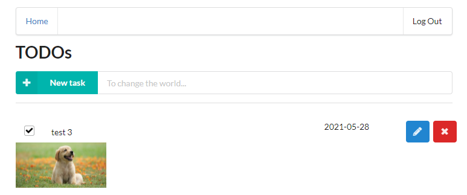

# Serverless TODO

Implementing a simple TODO application using AWS Lambda and Serverless framework.

## Development

Using the free service of auth0.com, I've registered a new application for my domain, named TODOApp. In the advanced settings/JWT type I've selected the RS256 and downloaded my certificate. I've set the callback URL to http://localhost:3000/callback to receive the authentication data (user (sub) id, token), and the Allowed Web Origins to http://localhost:3000 to allow connection. The domain and client id values saved in client/config.ts.

For token verification in backend/src/lambda/auth/auth0Authorizer.ts, I've set the certificate URL and followed the guide in https://auth0.com/blog/navigating-rs256-and-jwks/ and in https://github.com/auth0/node-jwks-rsa/blob/master/examples/express-demo/README.md. However the JSON file also has my other certificates, for the Udagram app, so later I changed back to include it in the source code.

Next I filled all the functions with mock data, and filled out the serverless.yml file with resource definitions for S3 and DynamoDB table structure.

After successful deployment, I copied the API Gateway ID to client/src/config.ts

The frontend `npm install` failed on a file rename, I suspect Visual Code in the background was parsing the files during setup. Closed VC, deleted package-lock.json and node_modules, and re-run the install successfully.

After frontend login, I got CORS errors, which was caused by missing `cors: true` for all the API calls.

The frontend now shows the mock data. Interestingly, the delete button works already, due to smart code on the client side.

Since I log all functions, I could already check in CloudWatch that all functions receive correct parameters. Authorization is not tested at this moment yet, because it's not yet configured. The UserId can be read from the authorization header, so next I implemented the functions using DynamoDB table.

First function has to be of course the createTodoItem. I've moved the DynamoDB specific functions to a new file, aws_access/createTodoItem.ts. When testing the new functionality, I got CORS error, but inspecting the headers revealed `InternalServerErrorException` in the header, so the CORS header was only missing because of an earlier exception.

From CloudWatch: `"errorMessage": "User: arn:aws:sts::447830847150:assumed-role/serverless-todo-app-dev-us-east-1-lambdaRole/serverless-todo-app-dev-CreateTodo is not authorized to perform: dynamodb:PutItem on resource: arn:aws:dynamodb:us-east-1:447830847150:table/Todos-dev"`

Since using `serverless-iam-roles-per-function` I added the following to the `CreateTodos` function:

```yaml
iamRoleStatements:
    - Effect: Allow
      Action:
        - dynamodb:PutItem
      Resource: arn:aws:dynamodb:${self:provider.region}:*:table/${self:provider.environment.TODOS_TABLE}
```

The deploy function failed with an error, Knowledge base suggested updating the package:

`npm i serverless-iam-roles-per-function@next`

The package.json was updated to: `"serverless-iam-roles-per-function": "^3.2.0-e97ab49",`

The client was working already, showing the new item, but of course, the new item vanished after refresh, so the next step was to implement GetTodos.

The implementation was straight forward, but the client got empty response. CloudWatch revealed `ERROR	(node:8) [DEP0005] DeprecationWarning: Buffer() is deprecated due to security and usability issues. Please use the Buffer.alloc(), Buffer.allocUnsafe(), or Buffer.from() methods instead.`

The issue was with missing `await`here:

```typescript
const db_result = {
    items: await getTodoItems(userId)
  }
```

Next error: `    "errorMessage": "User: arn:aws:sts::447830847150:assumed-role/serverless-todo-app-dev-GetTodos-us-east-1-lambdaRole/serverless-todo-app-dev-GetTodos is not authorized to perform: dynamodb:Query on resource: arn:aws:dynamodb:us-east-1:447830847150:table/Todos-dev/index/UserIdIndex",`

For the solution I used the example in Course 5, and added IamPolicy for the `Resource: arn:aws:dynamodb:${self:provider.region}:*:table/${self:provider.environment.TODOS_TABLE}/index/${self:provider.environment.USER_ID_INDEX}`

The item created previously was now listed in the browser.

Next was the delete item. The first error in CloudWatch was ` "errorMessage": "The provided key element does not match the schema"`

The problem here was described here: https://stackoverflow.com/questions/34259358/dynamodb-delete-all-items-having-same-hash-key

The solution was to include the RANGE key as well to make the record unique, which would have been dueDate in this case, since I originally added dueDate as RANGE key. When I deleted the RANGE key, deployment failed, so I deleted the table manually, and renamed the table as the CloudFront error suggested. After successful deployment, I renamed the table back to the original.

After implementing UpdateTodo, it didn't update the database, and I couldn't find any error message in CloudWatch. Searching the Knowledge Base I found that "name" attribute was replaced with ExpressionAttributeName, so I implemented it as well, but it didn't help. Logging the result revealed that I simply forgot to add ".promise()" to the end of the update call. After fixing, I could see the "done" flag updating in DynamoDB on AWS Console.

The last function was `GenerateUploadUrl`, I used the signed URL creation routine from the course 5, and the update from UpdateTodo in one function in `aws_access/GenerateUploadURL.ts`. I've set both dynamodb:UpdateItem and s3:PutObject in the iamRoleStatements of the lamda function. This one worked on first try.

Next step was to enable authorization for all functions. The first try reported `error:0909006C:PEM routines:get_name:no start line` in CloudWatch. I've fixed the new-lines in the certificate and it was working afterwards.

Next, I've set up request validator. I first tried with the plugin. For CreateTodoRequest and UpdateTodoRequest, I've created json files in model, set up a new resource, and linked the json files to the model names in the custom section. In the Knowledge Base it was suggested to have a minimum 3 characters for the name, so I included that too. I tried to create a 2-character long TODO item, and it was successful, so something didn't work. I realized I got warnings in the deployment:

```
Serverless: Configuration warning:
Serverless:   at 'functions.CreateTodo.events[0].http': unrecognized property 'reqValidatorName'
Serverless:   at 'functions.CreateTodo.events[0].http': unrecognized property 'documentation'
Serverless:   at 'functions.UpdateTodo.events[0].http': unrecognized property 'reqValidatorName'
Serverless:   at 'functions.UpdateTodo.events[0].http': unrecognized property 'documentation'
```

After searching for solution, I found that the plugin is no longer needed for serverless, and it's much simpler now:

```yaml
CreateTodo:
    handler: src/lambda/http/createTodo.handler
    events:
      - http:
          method: post
          path: todos
          cors: true
          authorizer: Auth
          request:
            schema:
              application/json: ${file(models/create-todo-request.json)}
```

After deployment, 2-character long name was denied, 3 character was accepted.

## Project Rubric

#### Functionality

```
The application allows users to create, update, delete TODO items
A user of the web application can use the interface to create, delete and complete a TODO item.
```

I've tested the functionality through the frontend during development, and also in the DynamoDB AWS Console, as described in the development process. The frontend can be started locally with `npm run start`

```
The application allows users to upload a file.
A user of the web interface can click on a "pencil" button, then select and upload a file. A file should appear in the list of TODO items on the home page.
```

Here's a screenshot after uploading an attachment



```
The application only displays TODO items for a logged in user.
If you log out from a current user and log in as a different user, the application should not show TODO items created by the first account.
```


```
Authentication is implemented and does not allow unauthenticated access.
A user needs to authenticate in order to use an application.
```

Authentication is implemented in backend/src/lamda/auth/auth0authorization.ts

#### Code Base

```
The code is split into multiple layers separating business logic from I/O related code.
Code of Lambda functions is split into multiple files/classes. The business logic of an application is separated from code for database access, file storage, and code related to AWS Lambda.
```

The aws_access folder contains the database access and file storage routines.

```
Code is implemented using async/await and Promises without using callbacks.
To get results of asynchronous operations, a student is using async/await constructs instead of passing callbacks.
```

An example from getTodoItems:

```typescript
const result = await docClient.query({
        TableName: todosTable,
        IndexName: userIdIndex,
        KeyConditionExpression: 'userId = :userId',
        ExpressionAttributeValues: {
          ':userId': userId
        }
      }).promise()
    
    return result.Items as TodoItem[]
```

#### Best Practices

```
All resources in the application are defined in the "serverless.yml" file
All resources needed by an application are defined in the "serverless.yml". A developer does not need to create them manually using AWS console.
```

Everything is defined here:

```yaml
resources:
  Resources:
    TodosTable:
      Type: AWS::DynamoDB::Table
      Properties:
        AttributeDefinitions:
          - AttributeName: todoId
            AttributeType: S
          - AttributeName: userId
            AttributeType: S
        KeySchema:
          - AttributeName: todoId
            KeyType: HASH
        BillingMode: PAY_PER_REQUEST
        TableName: ${self:provider.environment.TODOS_TABLE}
        GlobalSecondaryIndexes:
          - IndexName: ${self:provider.environment.USER_ID_INDEX}
            KeySchema:
              - AttributeName: userId
                KeyType: HASH
            Projection:
              ProjectionType: ALL # What attributes will be copied to an index

    AttachmentsBucket:
      Type: AWS::S3::Bucket
      Properties:
        BucketName: ${self:provider.environment.IMAGES_S3_BUCKET}
        CorsConfiguration:
          CorsRules:
            -
              AllowedOrigins:
                - '*'
              AllowedHeaders:
                - '*'
              AllowedMethods:
                - GET
                - PUT
                - POST
                - DELETE
                - HEAD
              MaxAge: 3000

    BucketPolicy:
      Type: AWS::S3::BucketPolicy
      Properties:
        PolicyDocument:
          Id: MyPolicy
          Version: "2012-10-17"
          Statement:
            - Sid: PublicReadForGetBucketObjects
              Effect: Allow
              Principal: '*'
              Action: 's3:GetObject'
              Resource: 'arn:aws:s3:::${self:provider.environment.IMAGES_S3_BUCKET}/*'
        Bucket: !Ref AttachmentsBucket
```

The naming convention is prepared for integration test with stage option (default: dev):

```yaml
  stage: ${opt:stage, 'dev'}
  environment:
    TODOS_TABLE: Todos-${self:provider.stage}
    IMAGES_S3_BUCKET: c4-final-images-033212455158-${self:provider.stage}
```


```
Each function has its own set of permissions.
Instead of defining all permissions under provider/iamRoleStatements, permissions are defined per function in the functions section of the "serverless.yml".
```


```
Application has sufficient monitoring.
Application has at least some of the following:
- Distributed tracing is enabled
- It has a sufficient amount of log statements
- It generates application level metrics
```


```
HTTP requests are validated
Incoming HTTP requests are validated either in Lambda handlers or using request validation in API Gateway. The latter can be done either using the serverless-reqvalidator-plugin or by providing request schemas in function definitions.
```

#### Architecture

```
Data is stored in a table with a composite key.
1:M (1 to many) relationship between users and TODO items is modeled using a DynamoDB table that has a composite key with both partition and sort keys. Should be defined similar to this:

   KeySchema:
      - AttributeName: partitionKey
        KeyType: HASH
      - AttributeName: sortKey
        KeyType: RANGE
```

The starter code suggested creating an index. Query through userId is done with using this index. Creating a composite key with anything else would break the deleteItem functionality, since it needs all keys to uniquely identify a record. I've ran into this problem when I tried to add dueDate as sort key.

```yaml
        KeySchema:
          - AttributeName: todoId
            KeyType: HASH
        TableName: ${self:provider.environment.TODOS_TABLE}
        GlobalSecondaryIndexes:
          - IndexName: ${self:provider.environment.USER_ID_INDEX}
            KeySchema:
              - AttributeName: userId
                KeyType: HASH
```


```
Scan operation is not used to read data from a database.
TODO items are fetched using the "query()" method and not "scan()" method (which is less efficient on large datasets)
```

This is how TODO items are fetched in backend/src/aws_access/getTodo.ts:

```typescript
 const result = await docClient.query({
        TableName: todosTable,
        IndexName: userIdIndex,
        KeyConditionExpression: 'userId = :userId',
        ExpressionAttributeValues: {
          ':userId': userId
        }
      }).promise()
    
    return result.Items as TodoItem[]
```


# Functionality of the application

This application will allow creating/removing/updating/fetching TODO items. Each TODO item can optionally have an attachment image. Each user only has access to TODO items that he/she has created.

# TODO items

The application should store TODO items, and each TODO item contains the following fields:

* `todoId` (string) - a unique id for an item
* `createdAt` (string) - date and time when an item was created
* `name` (string) - name of a TODO item (e.g. "Change a light bulb")
* `dueDate` (string) - date and time by which an item should be completed
* `done` (boolean) - true if an item was completed, false otherwise
* `attachmentUrl` (string) (optional) - a URL pointing to an image attached to a TODO item

You might also store an id of a user who created a TODO item.


# Functions to be implemented

To implement this project, you need to implement the following functions and configure them in the `serverless.yml` file:

* `Auth` - this function should implement a custom authorizer for API Gateway that should be added to all other functions.

* `GetTodos` - should return all TODOs for a current user. A user id can be extracted from a JWT token that is sent by the frontend

It should return data that looks like this:

```json
{
  "items": [
    {
      "todoId": "123",
      "createdAt": "2019-07-27T20:01:45.424Z",
      "name": "Buy milk",
      "dueDate": "2019-07-29T20:01:45.424Z",
      "done": false,
      "attachmentUrl": "http://example.com/image.png"
    },
    {
      "todoId": "456",
      "createdAt": "2019-07-27T20:01:45.424Z",
      "name": "Send a letter",
      "dueDate": "2019-07-29T20:01:45.424Z",
      "done": true,
      "attachmentUrl": "http://example.com/image.png"
    },
  ]
}
```

* `CreateTodo` - should create a new TODO for a current user. A shape of data send by a client application to this function can be found in the `CreateTodoRequest.ts` file

It receives a new TODO item to be created in JSON format that looks like this:

```json
{
  "createdAt": "2019-07-27T20:01:45.424Z",
  "name": "Buy milk",
  "dueDate": "2019-07-29T20:01:45.424Z",
  "done": false,
  "attachmentUrl": "http://example.com/image.png"
}
```

It should return a new TODO item that looks like this:

```json
{
  "item": {
    "todoId": "123",
    "createdAt": "2019-07-27T20:01:45.424Z",
    "name": "Buy milk",
    "dueDate": "2019-07-29T20:01:45.424Z",
    "done": false,
    "attachmentUrl": "http://example.com/image.png"
  }
}
```

* `UpdateTodo` - should update a TODO item created by a current user. A shape of data send by a client application to this function can be found in the `UpdateTodoRequest.ts` file

It receives an object that contains three fields that can be updated in a TODO item:

```json
{
  "name": "Buy bread",
  "dueDate": "2019-07-29T20:01:45.424Z",
  "done": true
}
```

The id of an item that should be updated is passed as a URL parameter.

It should return an empty body.

* `DeleteTodo` - should delete a TODO item created by a current user. Expects an id of a TODO item to remove.

It should return an empty body.

* `GenerateUploadUrl` - returns a pre-signed URL that can be used to upload an attachment file for a TODO item.

It should return a JSON object that looks like this:

```json
{
  "uploadUrl": "https://s3-bucket-name.s3.eu-west-2.amazonaws.com/image.png"
}
```

All functions are already connected to appropriate events from API Gateway.

An id of a user can be extracted from a JWT token passed by a client.

You also need to add any necessary resources to the `resources` section of the `serverless.yml` file such as DynamoDB table and S3 bucket.


# Frontend

The `client` folder contains a web application that can use the API that should be developed in the project.

This frontend should work with your serverless application once it is developed, you don't need to make any changes to the code. The only file that you need to edit is the `config.ts` file in the `client` folder. This file configures your client application just as it was done in the course and contains an API endpoint and Auth0 configuration:

```ts
const apiId = '...' API Gateway id
export const apiEndpoint = `https://${apiId}.execute-api.us-east-1.amazonaws.com/dev`

export const authConfig = {
  domain: '...',    // Domain from Auth0
  clientId: '...',  // Client id from an Auth0 application
  callbackUrl: 'http://localhost:3000/callback'
}
```

## Authentication

To implement authentication in your application, you would have to create an Auth0 application and copy "domain" and "client id" to the `config.ts` file in the `client` folder. We recommend using asymmetrically encrypted JWT tokens.

# Best practices

To complete this exercise, please follow the best practices from the 6th lesson of this course.

## Logging

The starter code comes with a configured [Winston](https://github.com/winstonjs/winston) logger that creates [JSON formatted](https://stackify.com/what-is-structured-logging-and-why-developers-need-it/) log statements. You can use it to write log messages like this:

```ts
import { createLogger } from '../../utils/logger'
const logger = createLogger('auth')

// You can provide additional information with every log statement
// This information can then be used to search for log statements in a log storage system
logger.info('User was authorized', {
  // Additional information stored with a log statement
  key: 'value'
})
```


# Grading the submission

Once you have finished developing your application, please set `apiId` and Auth0 parameters in the `config.ts` file in the `client` folder. A reviewer would start the React development server to run the frontend that should be configured to interact with your serverless application.

**IMPORTANT**

*Please leave your application running until a submission is reviewed. If implemented correctly it will cost almost nothing when your application is idle.*

# Suggestions

To store TODO items, you might want to use a DynamoDB table with local secondary index(es). A create a local secondary index you need to create a DynamoDB resource like this:

```yml

TodosTable:
  Type: AWS::DynamoDB::Table
  Properties:
    AttributeDefinitions:
      - AttributeName: partitionKey
        AttributeType: S
      - AttributeName: sortKey
        AttributeType: S
      - AttributeName: indexKey
        AttributeType: S
    KeySchema:
      - AttributeName: partitionKey
        KeyType: HASH
      - AttributeName: sortKey
        KeyType: RANGE
    BillingMode: PAY_PER_REQUEST
    TableName: ${self:provider.environment.TODOS_TABLE}
    LocalSecondaryIndexes:
      - IndexName: ${self:provider.environment.INDEX_NAME}
        KeySchema:
          - AttributeName: partitionKey
            KeyType: HASH
          - AttributeName: indexKey
            KeyType: RANGE
        Projection:
          ProjectionType: ALL # What attributes will be copied to an index

```

To query an index you need to use the `query()` method like:

```ts
await this.dynamoDBClient
  .query({
    TableName: 'table-name',
    IndexName: 'index-name',
    KeyConditionExpression: 'paritionKey = :paritionKey',
    ExpressionAttributeValues: {
      ':paritionKey': partitionKeyValue
    }
  })
  .promise()
```

# How to run the application

## Backend

To deploy an application run the following commands:

```
cd backend
npm install
sls deploy -v
```

## Frontend

To run a client application first edit the `client/src/config.ts` file to set correct parameters. And then run the following commands:

```
cd client
npm install
npm run start
```

This should start a development server with the React application that will interact with the serverless TODO application.

# Postman collection

An alternative way to test your API, you can use the Postman collection that contains sample requests. You can find a Postman collection in this project. To import this collection, do the following.

Click on the import button:


Click on the "Choose Files":


Select a file to import:


Right click on the imported collection to set variables for the collection:


Provide variables for the collection (similarly to how this was done in the course):


